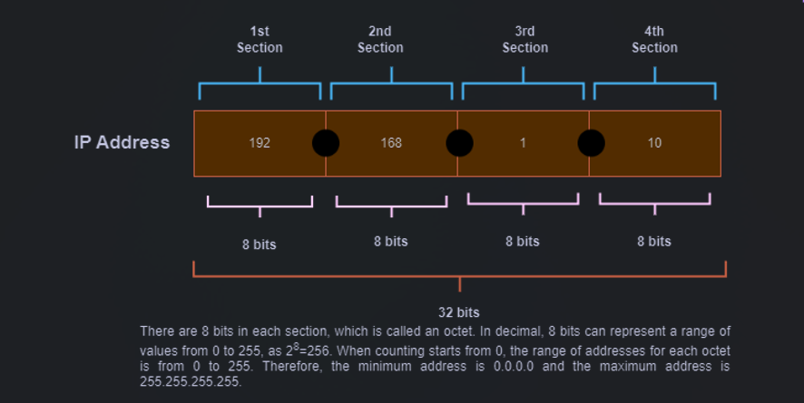

# IP address & Default IP subnet

## IP address ဆိုတာဘာလဲ

IP address ဆိုတာကတော့ Network ချိတ်ဆက်ထားတဲ့ Device တွေရဲ့ address ဖြစ်ပါတယ်။&#x20;

IP address မှာ 32 bits ရှိပြီးတော့ 8bits စီကို dot ကို အသုံးပြုပြီး  section (၄) ခုပိုင်းထားပါတယ် ။

Section တစ်ခုစီမှာ 8bits ရှိနေမှာဖြစ်လို့ Octet လို့လဲခေါ်နိုင်ပါတယ်။

&#x20;Binary 8 bits ဖြစ်လို့ decimal နဲ့ပြောမယ်ဆိုရင် 2^8 = 256 ဖြစ်တဲ့အတွက် IP address ရဲ့ section တစ်ခုစီမှာ range 0-255 ထိရှိပါတယ်။

<figure><figcaption>
IP Address
</figcaption></figure>

## Subnetting

&#x20;Subnet ဆိုတာကတော့ network တစ်ခုကို smaller network အနေနဲ့ ပိုင်းထားခြင်းပဲဖြစ်ပါတယ်။

&#x20;ဥပမာ - university campus တစ်ခုလုံးတူညီတဲ့ network တစ်ခုတည်းကိုအသုံးပြုလို့ရနေမယ်ဆိုရင် ဒါကို single network လို့ခေါ်ပါတယ် ။&#x20;

အဲ့ကနေမှ ကျောင်းသားတွေသုံးမယ့် network ကတစ်ခု ၊ ဆရာတွေအတွက်network ကတစ်ခု ၊ guest အတွက် network ကတစ်ခုခွဲထားခဲ့မယ်ဆိုရင် ဒါကို single network ကနေ network segment လေးတွေခွဲထုတ်တယ် subnetting လုပ်တယ်လို့ခေါ်ပါတယ်။

&#x20;ဒီလို segment group တစ်ခုစီကခွဲထားတဲ့ group of IP address တွေကိုတော့ IP subnetsလို့ခေါ်ပါတယ်။

<figure><figcaption>
Single Network
</figcaption></figure>

<figure><figcaption>
Subnetting Network
</figcaption></figure>

## Subnetting ကဘာလို့အရေးပါတာလဲ

Subnetting က Larger Network တစ်ခုကို လိုအပ်သလောက် hosts အရေအတွက်ပေါ်မူတည်ပြီး ပိုင်းခြားနိုင်တာဖြစ်လို့ manage လုပ်ရတာလဲလွယ်ကူစေသလို မလိုအပ်ဘဲ address တွေဖောင်းပွနေတာတွေ ၊ Networkမခွဲထားတဲ့အတွက် Network တစ်ခုထဲမှာ hosts တွေအများကြီးရှိနေတာကြောင့် congest ဖြစ်နေတာမျိုးကိုလဲလျှော့ချနိုင်မှာဖြစ်ပါတယ်။

## Host Address ၊ Network Address

IP address တစ်ခုမှာဆိုရင်တော့ Network address နဲ့ Host address ဆိုပြီး (၂) ပိုင်းပါဝင်ပါတယ်။&#x20;

Network address ဆိုတာကတော့ Network segment တစ်ခုကိုကိုယ်စားပြုတဲ့ Address ဖြစ်ပါတယ်။

&#x20;Host address ဆိုတာကတော့ အဲ့ဒီ Network segment ထဲမှာပါတဲ့ host တစ်ခုစီကိုကိုယ်စားပြုပါတယ်။

Subnet တစ်ခုချင်းစီရဲ့ ပထမဆုံးနဲ့နောက်ဆုံး address တွေကိုတော့ Network address နဲ့ Broadcast address အတွက် Reserve လုပ်ထားတာဖြစ်ပါတယ်။

&#x20;ကြားထဲက Address တွေကိုတော့ Host Address အတွက် အသုံးပြုနိုင်ပါတယ်။

ဥပမာ - Network Address ကို တိုက်နံပါတ်လို့စဉ်းစားရင် အဲ့တိုက်က တိုက်ခန်းတွေရဲ့နံပါတ်က Host Address ဖြစ်ပါတယ်။

## Default IP Subnet

IP subnet ကိုလဲ Default နဲ့ Customဆိုပြီး ၂မျိုးခွဲထားပါတယ်။&#x20;

Default IP subnet (group of IP addresses)ကို အသုံးပြုနိုင်တဲ့ address range နဲ့ purpose အပေါ်မူတည်ပြီး class A-E ခွဲထားပါတယ်။

| Name    | First octet |
| ------- | ----------- |
| Class A | 1 to 126    |
| Class B | 128 to 191  |
| Class C | 192 to 223  |
| Class D | 224 to 239  |

## Class A

Class A ကိုတော့ very Large-sized Network အတွက်အသုံးပြုနိုင်ပြီး IP address ရဲ့ ပထမ section က Network address ကျန်တဲ့ section တွေက Host address ဆိုပြီးပိုင်းထားပါတယ်။

<figure><figcaption>
IP Address of Class A
</figcaption></figure>

Class A ရဲ့ First Octet ကိုတော့ default အနေနဲ့ 0-127 ဆိုပြီး သတ်မှတ်ထားပါတယ် ။

&#x20;Binary အနေနဲ့ကြည့်မယ်ဆိုရင်&#x20;

* &#x20;    0 -> <mark style="color:yellow;">0</mark>000000&#x20;
* &#x20;127 -> <mark style="color:yellow;">0</mark>1111111

First bit 0 ကို omit လုပ်ပြီး ကျန်တဲ့ 7bits (2^7=128 networks) ကို ဒီ class မှာအသုံးပြုနိုင်မှာဖြစ်ပါတယ်။&#x20;

Host အနေနဲ့ ကျန်တဲ့ 24 bits မှာ ( 2^24 = 16777216(-2) = 16777214) ကိုတော့ (0.0.0 to 255.255.255) ဆိုပြီး host address အနေနဲ့အသုံးပြုနိုင်မှာဖြစ်ပါတယ် ။&#x20;

Network 0 ကို default network ၊ 127.0.0.0 to 127.255.255.255 ကိုတော့ မိမိရဲ့ local machine မှာ testing လုပ်ဖို့ loopback address အနေနဲ့ reserved လုပ်ထားတာဖြစ်လို့ IP address အနေနဲ့အသုံးပြုလို့မရပါဘူး။

အဲ့အတွက် class Aရဲ့ Network address ကတော့ ပထမဆုံး Address ဖြစ်တဲ့ 1.0.0.0 ဖြစ်ပြီး နောက်ဆုံး Address ဖြစ်တဲ့ 126.255.255.255 ကိုတော့ Broadcast address အနေနဲ့အသုံးပြုနိုင်ပါတယ် ။&#x20;

Host address တွေအနေနဲ့ကတော့ 1.0.0.1 to 126.255.255.254 ဖြစ်ပါတယ် ။

&#x20;<mark style="color:purple;">**Summary**</mark>&#x20;

* Network Address: X.0.0.0 (where X is any number from 1 to 126)&#x20;
* Broadcast Address: X.255.255.255
* First Usable Host Address: X.0.0.1&#x20;
* &#x20;Last Usable Host Address: X.255.255.254

## Class B

Class B ကိုတော့ medium to Large-sized network တွေအတွက်အသုံးပြုပြီးတော့ IP address ရဲ့ ပထမ section ၂ခုက Network address ကျန်တဲ့ section တွေက Host address ဆိုပြီးပိုင်းထားပါတယ် ။&#x20;

<figure><figcaption>
IP Address of Class B
</figcaption></figure>

Class B ရဲ့ First Octet ကိုတော့ default အနေနဲ့ 128-191 ဆိုပြီး သတ်မှတ်ထားပါတယ် ။&#x20;

ဒီနေရာမှာ network အရေအတွက်ကို binary number နဲ့ ပြန်စဉ်းစာမယ်ဆိုရင်

* 128 -> <mark style="color:yellow;">10</mark>000000&#x20;
* 191  -> <mark style="color:yellow;">10</mark>111111&#x20;

ရှေ့ဆုံး 2 bits(10) ကပြောင်းလဲခြင်းမရှိဘဲ နောက် 6 bits သာပြောင်းလဲအတွက် number of network ကိုတွက်မယ်ဆိုရင် ပထမ section က 6 bits ၊ ဒုတိယ section က 8 bits စုစုပေါင်း 14 bits ဖြစ်လို့ 2^14 = 16,384 networks ရှိမှာဖြစ်ပါတယ်။

Host အနေကတော့ကျန်တဲ့ section 2ခုက 8bit စီနဲ့ 2^16= (65,534) -2 hosts ရှိမှာဖြစ်ပါတယ်။

class B အတွက် Network address ကတော့ ပထမဆုံး Address ဖြစ်တဲ့ 128.0.0.0 ဖြစ်ပြီး နောက်ဆုံး Address ဖြစ်တဲ့ 191.255.255.255 ကိုတော့ Broadcast address အနေနဲ့အသုံးပြုနိုင်ပါတယ် ။&#x20;

Host address တွေအနေနဲ့ကတော့ 128.0.0.1 to 191.255.255.254 ဖြစ်ပါတယ် ။&#x20;

<mark style="color:purple;">**Summary**</mark>

* Network Address: X.Y.0.0 (where X ranges from 128 to 191 and Y is any number from 0 to 255)
* Broadcast Address: X.Y.255.255&#x20;
* First Usable Host Address: X.Y.0.1
* &#x20;Last Usable Host Address: X.Y.255.254

## Class C

Class C ကိုတော့ smaller network တွေ organization  အတွက်အသုံးပြုနိုင်ပြီး IP address ရဲ့ ပထမ section ၃ခုက Network address ကျန်တဲ့ section က Host address ဆိုပြီးပိုင်းထားပါတယ် ။

<figure><figcaption>
IP Address of Class C
</figcaption></figure>

Class C အတွက် default သတ်မှတ်ပေးထားတဲ့ range က (192-223) ဖြစ်လို့&#x20;

network အရေအတွက်အတွက် binary number နဲ့ ကြည့်မယ်ဆိုရင်

&#x20;192 -> <mark style="color:yellow;">110</mark>00000&#x20;

223  -> <mark style="color:yellow;">110</mark>11111&#x20;

ရှေ့ဆုံး 3 bits(110) ကပြောင်းလဲခြင်းမရှိဘဲ နောက် 5 bits သာပြောင်းလဲအတွက် number of network ကိုတွက်မယ်ဆိုရင် ပထမ section က 5 bits ၊ ဒုတိယ section က 8 bits ၊ တတိယ section က 8 bits စုစုပေါင်း 21 bits ဖြစ်လို့ 2^21 = 2,097,152 networks အသုံးပြုနိုင်မှာဖြစ်ပြီး&#x20;

Host အတွက် နောက်ဆုံး section ရဲ့ 8bit နဲ့အသုံးပြုလို့ရမှာဖြစ်လို့ 2^8= 256-2 hosts ရှိမှာဖြစ်ပါတယ်။&#x20;

class C အတွက် Network address ကတော့ ပထမဆုံး Address ဖြစ်တဲ့ 192.0.0.0 ဖြစ်ပြီး နောက်ဆုံး Address ဖြစ်တဲ့ 223.255.255.255 ကိုတော့ Broadcast address အနေနဲ့အသုံးပြုနိုင်ပါတယ် ။

&#x20;Host address တွေအနေနဲ့ကတော့ 192.0.0.1 to 223.255.255.254 ဖြစ်ပါတယ် ။&#x20;

<mark style="color:purple;">**Summary**</mark>&#x20;

* Network Address: X.Y.Z.0 (where X ranges from 192 to 223, and Y and Z are any numbers from 0 to 255)&#x20;
* Broadcast Address: X.Y.Z.255
* &#x20;First Usable Host Address: X.Y.Z.1&#x20;
* Last Usable Host Address: X.Y.Z.254

## Class D & E

Class D ကိုတော့ Multicast Group တွေ အတွက်သုံးပြီး Class E ကိုတော့ Further research တွေအတွက် reserved လုပ်ထားတာဖြစ်လို့ IP address တွေပေးတဲ့အခါ class A-C ကိုပဲသုံးလို့ရမှာဖြစ်ပါတယ်။

